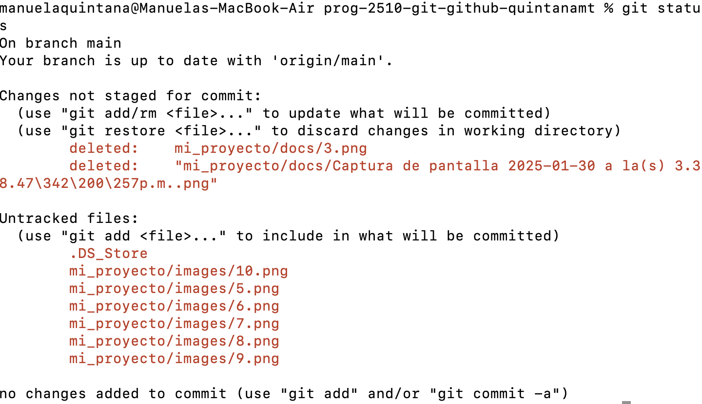
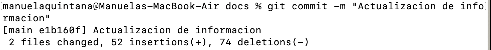
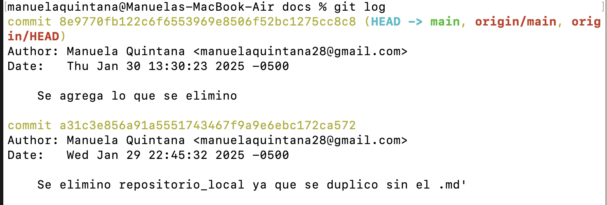

---

## `repositorio_local.md`

# Crear un Repositorio Local con Git

Git es una herramienta de control de versiones que permite rastrear cambios en archivos y directorios. Aquí se explica cómo crear y gestionar un repositorio local.

### Comandos Básicos

1. **Inicializar un repositorio:**
   - `git init`: Crea un nuevo repositorio Git en el directorio actual.

2. **Verificar el estado del repositorio:**
   - `git status`: Muestra el estado actual del repositorio, incluyendo archivos modificados y no rastreados.

 

3. **Agregar archivos al área de preparación (STAGE):**
   - `git add <nombre_archivo>`: Agrega un archivo al área de preparación.
   - `git add .`: Agrega todos los archivos modificados y no rastreados.

4. **Confirmar cambios (commit):**
   - `git commit -m "mensaje"`: Guarda los cambios en el repositorio con un mensaje descriptivo.

5. **Ver el historial de commits:**
   - `git log`: Muestra el historial de commits con detalles como autor, fecha y mensaje.
   - `git log --oneline`: Muestra una versión resumida del historial.

6. **Deshacer cambios:**
   - `git restore <nombre_archivo>`: Descarta los cambios en un archivo.
   - `git restore --staged <nombre_archivo>`: Saca un archivo del área de preparación.

