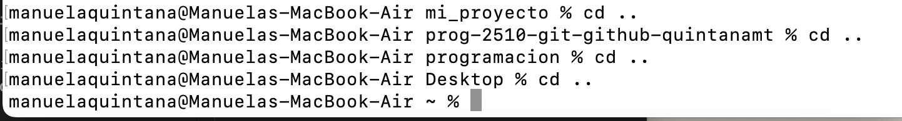
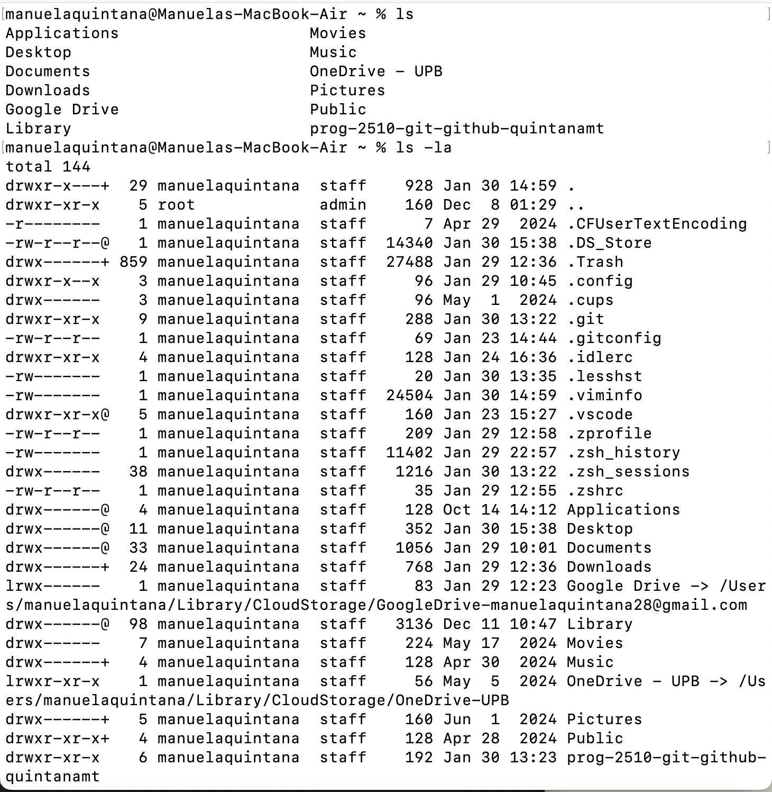

# Uso de la Consola para Navegar y Crear Directorios y Archivos

La consola es una herramienta poderosa para interactuar con el sistema operativo. Aquí se describen los conceptos básicos para navegar y crear directorios y archivos.

### Comandos Básicos

1. **Navegar entre directorios:**
   - `cd <directorio>`: Cambia al directorio especificado.
   - `cd ..`: Sube un nivel en la jerarquía de directorios.
   - `cd`: Sin argumentos, te lleva al directorio home.

2. **Listar archivos y directorios:**
   - `ls`: Muestra los archivos y directorios en el directorio actual.
   - `ls -a`: Muestra todos los archivos, incluyendo los ocultos.

3. **Crear directorios:**
   - `mkdir <nombre_directorio>`: Crea un nuevo directorio.

4. **Crear archivos:**
   - `touch <nombre_archivo>`: Crea un archivo vacío.

5. **Ver el contenido de un archivo:**
   - `cat <nombre_archivo>`: Muestra el contenido del archivo en la consola.

6. **Eliminar archivos y directorios:**
   - `rm <nombre_archivo>`: Elimina un archivo.
   - `rm -r <nombre_directorio>`: Elimina un directorio y su contenido.

